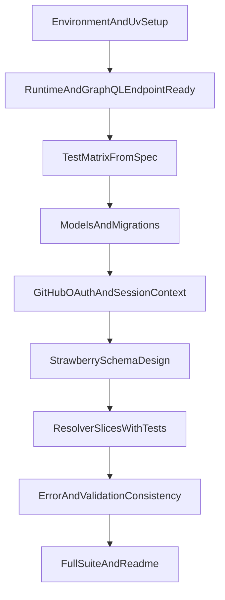

# FastAPI GraphQL Rebuild Tutorial Plan

## Goal
Recreate the behavior defined in [`/Users/carloswimmer/Documents/Estudos/Frameworks/python-fast-api/board-api/.cursor/SPEC.md`](/Users/carloswimmer/Documents/Estudos/Frameworks/python-fast-api/board-api/.cursor/SPEC.md) using:
- FastAPI
- Strawberry GraphQL
- PostgreSQL
- GitHub authentication
- `uv` for project/dependency management

This is a learning-first tutorial path you can execute manually with autocomplete (without Agent mode).

## Project Milestones

### 1) Bootstrap environment and project skeleton
- Initialize project with `uv` (`pyproject.toml`, virtual env, lock file).
- Set up folder structure for:
  - `app/main.py`
  - `app/graphql/` (schema, types, inputs, resolvers)
  - `app/db/` (models, session, migrations)
  - `app/auth/` (GitHub OAuth/session helpers)
  - `tests/unit/` and `tests/integration/`
- Add baseline dependencies (FastAPI, Strawberry, SQLAlchemy/SQLModel, Alembic, psycopg, pytest, httpx, testcontainers or equivalent for Postgres integration tests).
- Add `.env.example` with required variables (DB URL, GitHub OAuth credentials, app secret).
- Add a `docker-compose` service for local PostgreSQL.
- Create initial health route and GraphQL endpoint mount to confirm runtime wiring.

### 2) Runtime readiness before API implementation
- Configure app settings loader (env validation).
- Configure DB engine/session and startup check.
- Configure Alembic and generate first empty migration.
- Run app and verify:
  - API boots
  - GraphQL endpoint is reachable
  - DB connection succeeds

### 3) Test strategy (planned before implementation)
Define a complete test matrix derived from SPEC before writing resolvers:
- **Unit tests**
  - Status enum mapping
  - Input validation helpers
  - Ownership/auth guard functions
  - Like toggle transaction logic (isolated)
- **Integration tests (GraphQL operations)**
  - Query: `issues`, `issue`, `issueComments`, `issueInteractions`
  - Mutation: `createIssue`, `updateIssue`, `deleteIssue`, `createComment`, `updateComment`, `deleteComment`, `toggleIssueLike`
  - Error-paths: unauthorized, forbidden, not found, bad request
- Write a checklist mapping each SPEC requirement to at least one test case.
- Decide fixtures strategy:
  - Seed helpers for users/issues/comments/likes
  - Auth fixture for anonymous vs authenticated user
  - Isolated test database per run

### 4) Data model and migrations
- Implement SQL models for:
  - `issues`
  - `comments`
  - `issue_likes`
  - `users`
  - `sessions` (or equivalent session storage for OAuth login state)
- Add constraints/indexes from SPEC:
  - unique issue number
  - unique (`issue_id`, `user_id`) in likes
  - lookup indexes for issue status/title and comments sorting
- Create and apply migrations.

### 5) Authentication foundation (GitHub)
- Implement GitHub OAuth flow in FastAPI.
- Persist user/session and expose `current_user` in GraphQL context.
- Add auth middleware/context injection for resolvers.
- Add auth-focused tests:
  - anonymous context
  - authenticated context
  - session resolution failure

### 6) GraphQL schema design pass
- Implement Strawberry enums/scalars/types/inputs mirroring SPEC contract.
- Define Query and Mutation roots with exact operation names from SPEC.
- Centralize error translation into GraphQL `errors` with `extensions.code`.

### 7) Resolver implementation in vertical slices
Implement in this order (each slice: code + tests + refactor):
1. `issues` list query (filters/search/sort/group by status + comments count)
2. `issue` query
3. `createIssue`, `updateIssue`, `deleteIssue`
4. `issueComments` query (pagination + ordering)
5. `createComment`, `updateComment`, `deleteComment` (ownership checks)
6. `issueInteractions` query
7. `toggleIssueLike` mutation (transactional update)

### 8) Validation and error consistency pass
- Ensure all error categories map consistently:
  - `BAD_REQUEST`, `UNAUTHORIZED`, `FORBIDDEN`, `NOT_FOUND`
- Ensure GraphQL payload behavior remains semantically equivalent to current Node API.
- Verify datetime and timezone behavior (UTC).

### 9) Final verification and developer usability
- Run full test suite (unit + integration).
- Add command shortcuts in `pyproject.toml` scripts (run app, migrate, test).
- Write concise `README` walkthrough:
  - environment setup
  - run database
  - run migrations
  - run server
  - run tests
  - execute sample GraphQL queries/mutations

## Execution Order Diagram

## Tutorial Rules While You Implement Manually
- Implement one milestone at a time.
- Do not move to the next milestone until its checks/tests pass.
- Keep commit scope small (one slice per commit).
- Prefer fixing tests immediately when behavior diverges from SPEC.
- Keep SPEC open and update plan checklist status as you progress.

## Suggested first practical session
1. Bootstrap with `uv` and install dependencies.
2. Start PostgreSQL via docker compose.
3. Wire FastAPI app + Strawberry endpoint + DB session.
4. Confirm app boots and GraphQL endpoint answers introspection.
5. Create test matrix file based on SPEC before writing domain resolvers.
